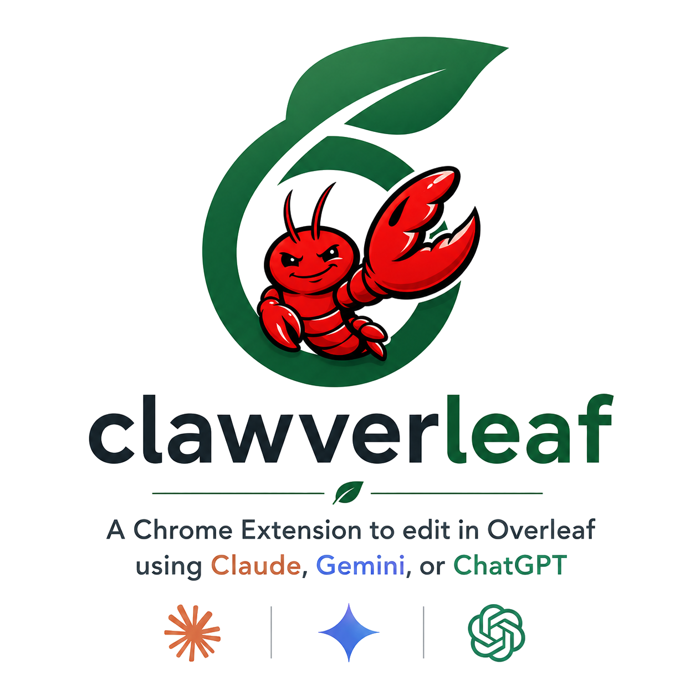

<h1 align="center">Clawverleaf</h1>
Inline AI editing for Overleaf selections with Claude or ChatGPT.
Select text in Overleaf, click Edit, review the suggested diff, then approve or reject it.
Load this folder as an unpacked Chrome extension and configure providers in the options page.
